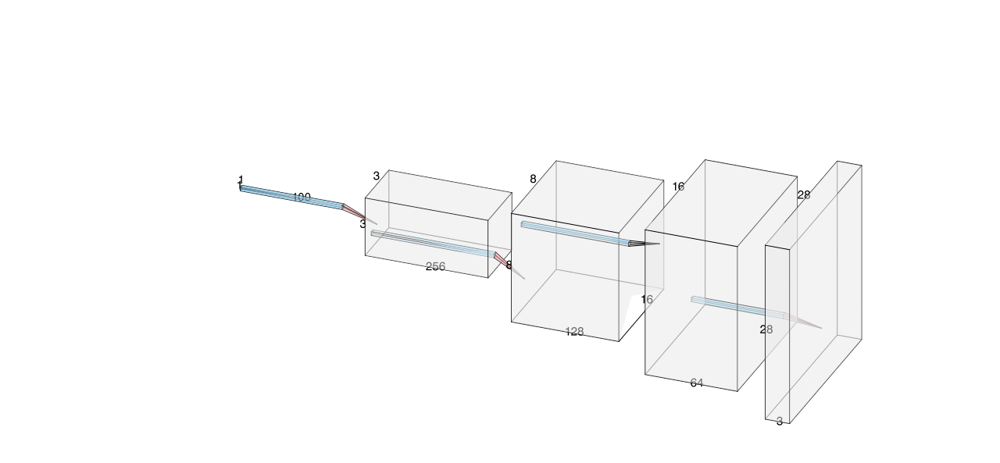
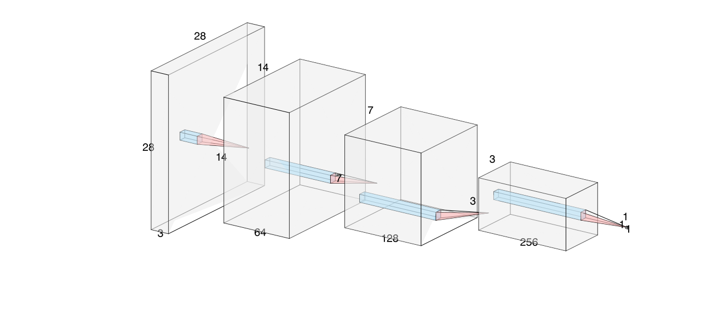
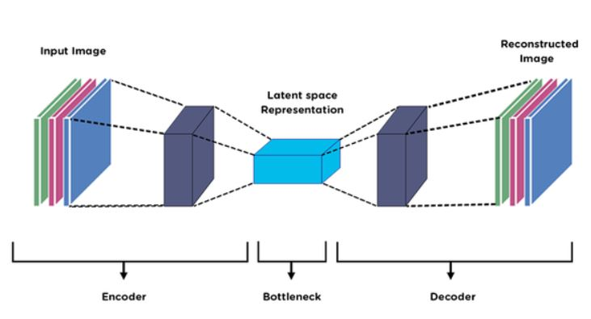
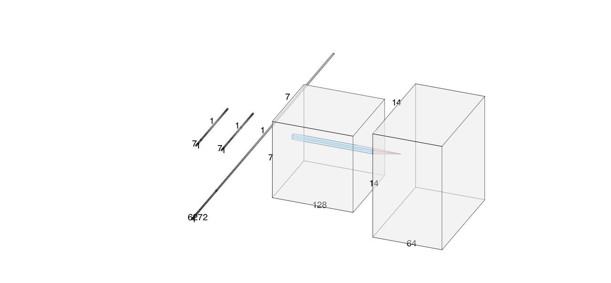

# DCGAN vs. Autoencoder: A Comparative Study on Generative Models

This project focuses on exploring and comparing two popular generative models:
**Deep Convolutional Generative Adversarial Networks** (DCGANs) and
**Autoencoders**. The goal is to evaluate the effectiveness of each model in
generating and reconstructing images and to provide insights into their
performance, architecture and applications.

## Contents

- [1. Introduction](#intro)
- [2. Overview](#ovv)
- [3. Requirements](#req)
- [4. Dataset](#dat)
- [5. Model Architectures](#modarch)
- [6. Training process](#trproc)
- [7. Evaluation](#eval)
- [8. Result](#rslt)
- [9. Conclusion](#cls)


<div id='intro'/>

## 1. Introduction

Generative models are powerful tools in **Deep Learning** that can generate
new data instances from a learned data distribution. This project compares two
generative approaches:

**DCGAN** - A direct extension of the GAN architecture that uses convolutional
and convolutional-transpose layers for the discriminator and generator,
respectively.

**Autoencoder** - A trained neural network to reconstruct its input, which can
also be used for generating new data by sampling from the latent space.

<div id='ovv'/>

## 2. Overview

The project consists of the following steps:
- Implement and train a DCGAN to generate realistic images.
- Implement and train an Autoencoder for image reconstruction.
- Evaluate the quality of images generated by both models.
- Compare the two models based on various metrics like image quality,
training time, and stability.

<div id='req'/>

## 3. Requirements

To run this project, you need the following libraries and tools:

- Python 3.7+
- PyTorch
- torchvision
- matplotlib
- numpy
- Jupyter Notebook (optional, for interactive exploration)

You can install the required dependencies using:
````
pip install torch torchvision matplotlib numpy
````

<div id='dat'/>

## 4. Dataset

For this project, we use the
[MNIST dataset](https://yann.lecun.com/exdb/mnist/). Torchvision is a package
in the PyTorch library containing computer-vision models, datasets, and image
transformations. Since we want to get the MNIST dataset from the torchvision
package, let’s next import the torchvision datasets and initialize dataset:

```
import torchvision.datasets as datasets
mnist_trainset = datasets.MNIST(root='./data', train=True, download=True, transform=None)
```

<div id='modarch'/>

## 5. Model Architectures

### 5.1. DCGAN

A DCGAN consists of two networks: a Generator and a Discriminator.
These networks are trained adversarially—i.e., the Generator tries
to generate realistic images, while the Discriminator tries to
distinguish between real and generated images.

#### 5.1.1. Generator Architecture

The Generator Network consists of transposed convolutional layers,
batch normalization, and ReLU activations, culminating in a tanh activation
function to output realistic images. In detail, the Generator transforms a
latent vector z (usually sampled from a normal distribution) into a synthetic
image through a series of transposed convolutional layers. Each layer increases
the spatial dimensions of the input while reducing the depth, creating a
realistic image with the following structure:

- Input:
    - A latent vector of size nz (default 100), reshaped to (nz, 1, 1).
- First Transposed Convolution Layer:
    - Input: (nz, 1, 1)
    - Output: (ngf * 4, 3, 3) (default ngf=64, so 256 channels)
    - Kernel size: 3
    - Stride: 2
    - Padding: 0
    - Activation: ReLU
    - Batch Normalization: Yes
- Second Transposed Convolution Layer:
    - Input: (ngf * 4, 3, 3)
    - Output: (ngf * 2, 8, 8) (default 128 channels)
    - Kernel size: 3
    - Stride: 2
    - Padding: 0
    - Activation: ReLU
    - Batch Normalization: Yes
- Third Transposed Convolution Layer:
    - Input: (ngf * 4, 3, 3)
    - Output: (ngf, 16, 16) (default 64 channels)
    - Kernel size: 3
    - Stride: 2
    - Padding: 0
    - Activation: ReLU
    - Batch Normalization: Yes
- Final Output Layer:
    - Input: (ngf, 16, 16)
    - Output: (nc, 28, 28) (where nc=3 for RGB images)
    - Kernel size: 3
    - Stride: 2
    - Padding: 2
    - Output Padding: 1
    - Activation: Tanh (to scale pixel values between -1 and 1).

#### Generator in AlexNet style


#### 5.1.2. Discriminator Architecture

The discriminator takes an image (real or fake) and classifies it as real
or fake using a series of convolutional layers:

- Input:
    - Image tensor of size (nc, 28, 28) (where nc=3 for RGB images)
- First Convolution Layer:
    - Input: (nc, 28, 28)
    - Output: (ndf, 14, 14) (default ndf=64, so 64 channels)
    - Kernel size: 4
    - Stride: 2
    - Padding: 1
    - Activation: Leaky ReLU (α=0.2)
    - Batch Normalization: No
- Second Convolution Layer:
    - Input: (ndf, 14, 14)
    - Output: (ndf * 2, 7, 7) (default 128 channels)
    - Kernel size: 4
    - Stride: 2
    - Padding: 1
    - Activation: Leaky ReLU (α=0.2)
    - Batch Normalization: Yes
- Third Convolution Layer:
    - Input: (ndf * 2, 7, 7)
    - Output: (ndf * 4, 3, 3) (default 256 channels)
    - Kernel size: 4
    - Stride: 2
    - Padding: 1
    - Activation: Leaky ReLU (α=0.2)
    - Batch Normalization: Yes
- Final Convolution Layer:
    - Input: (ndf * 4, 3, 3)
    - Output: (1, 1, 1) (single scalar output indicating real or fake image score)
    - Kernel size: 4
    - Stride: 2
    - Padding: 1
    - Activation: Leaky ReLU
    - Activation: None (raw logits used with nn.BCEWithLogitsLoss)

#### Discriminator in AlexNet style


### 5.2. Autoencoder

An Autoencoder consists of two main components: an Encoder and a Decoder.
The Encoder compresses an input image into a lower-dimensional latent
representation, and the Decoder reconstructs the original image from
this representation.



#### 5.2.1. Encoder Architecture

The Encoder gradually reduces the spatial dimensions of the input
image while increasing feature depth. This results in a compressed
latent representation. Layer-by-Layer Breakdown:

- Input Layer:
    - Image tensor of size (batch_size, 1, 28, 28) (grayscale image)
- First Convolution Layer:
    - Input: (batch_size, 1, 28, 28)
    - Output: (batch_size, 64, 14, 14)
    - Kernel size: 4
    - Stride: 2
    - Padding: 1
    - Activation: ReLU
    - Batch Normalization: No
- Second Convolution Layer:
    - Input: (batch_size, 64, 14, 14)
    - Output: (batch_size, 128, 7, 7)
    - Kernel size: 4
    - Stride: 2
    - Padding: 1
    - Activation: ReLU
    - Batch Normalization: Yes
- Flatten Layer:
    - Input: (batch_size, 128, 7, 7)
    - Output: (batch_size, 6272)
- Linear Layer:
    - Input: (batch_size, 6272)
    - Output: (batch_size, 7)
    - Activation: None (raw features for representation in latent space)

#### Encoder in AlexNet style


#### 5.2.2. Decoder Architecture

The Encoder compresses an input image of size (batch_size, 1, 28, 28). Layer-by-Layer Breakdown:

- Input Layer:
    - Input: Latent vector of size (batch_size, 7)
- First Linear Layer:
    - Input: (batch_size, 7)
    - Output: (batch_size, 6272)
    - Activation: ReLU
- Reshape Layer:
    - Input: (batch_size, 6272)
    - Output: (batch_size, 128, 7, 7)
- First Transposed Convolutional Layer:
    - Input: (batch_size, 128, 7, 7)
    - Output: (batch_size, 64, 14, 14)
    - Kernel Size: 4
    - Stride: 2
    - Padding: 1
    - Activation: ReLU
    - Batch Normalization: Yes
- Second Transposed Convolutional Layer:
    - Input: (batch_size, 64, 14, 14)
    - Output: (batch_size, 1, 28, 28) (grayscale image reconstruction)
    - Kernel Size: 4
    - Stride: 2
    - Padding: 1
    - Activation: Tanh (to scale pixel values between -1 and 1)

#### Decoder in AlexNet style


This architecture captures the structure of the Autoencoder, where the Encoder compresses the input image into a latent vector, and the Decoder reconstructs the image from this representation.

<div id='trproc'/>

## 6. Training process

### 6.1. Training DCGAN

Train a Generative Adversarial Network (GAN) where a Generator creates realistic images, and a Discriminator distinguishes between real and fake images.

#### 6.1.1. Training steps

- Initialize Networks and Optimizers:
    - Use nn.ConvTranspose2d layers in the Generator and nn.Conv2d layers in the Discriminator.
    - Optimizer: Adam with learning rate 0.0002 and beta1=0.5.
    - Loss Function: Binary Cross-Entropy Loss (BCEWithLogitsLoss)

- Adversarial Training Loop:
    - Step 1: Train the Discriminator
        - Pass real images to the Discriminator.
        - Calculate loss with real labels (1s).
        - Generate fake images using the Generator with random noise (z).
        - Pass fake images to the Discriminator.
        - Calculate loss with fake labels (0s).
        - Backpropagate and update Discriminator weights.
    - Step 2: Train the Generator
        - Generate fake images using the Generator.
        - Pass them to the Discriminator.
        - Calculate loss with real labels (1s) — the Generator tries to fool the Discriminator.
        - Backpropagate and update Generator weights.

- Repeat the Process:
    - Alternate between updating the Discriminator and the Generator.
    - Monitor the loss of both networks.

- Evaluate the Results:
    - Periodically save generated images to visually inspect the quality.

#### 6.1.2. Key notes

- Mode Collapse: The Generator might produce limited varieties of images.
- Stability: Proper hyperparameter tuning (e.g., lr, beta1) is critical for stable training.
- Loss Interpretation: The Discriminator loss and Generator loss don't necessarily converge to zero; their balance matters more.

### 6.2. Training Autoencoder

Train an Autoencoder to reconstruct input images by learning a compressed representation (latent space).

#### 6.1.1. Training steps

- Initialize Networks and Optimizer:
    - Use nn.Conv2d layers in the Encoder and nn.ConvTranspose2d layers in the Decoder.
    - Optimizer: Adam with a default learning rate (e.g., 0.001).
    - Loss Function: Mean Squared Error (MSE)

- Forward Pass:
    - Pass input images through the Encoder to extract the latent representation.
    - Decode the latent vector using the Decoder to reconstruct the input image.

- Calculate Reconstruction Loss:
    - Compute MSE Loss between the original image and the reconstructed image.

- Backpropagation and Update:
    - Backpropagate the loss through both the Encoder and Decoder networks.
    - Update weights using the Adam optimizer.

- Repeat the Process:
    - Iterate through the dataset for multiple epochs.
    - Monitor the reconstruction loss to ensure the model improves.

- Evaluate Reconstruction Quality:
    - Periodically reconstruct sample images and compare them with the original inputs.

#### 6.1.2. Key notes

- Overfitting: Autoencoders can memorize the training set, so regularization may be necessary.
- Latent Space Interpretation: A well-trained Encoder produces a meaningful compressed representation.
- Reconstruction Accuracy: The focus is on minimizing pixel-level differences using MSE Loss.

### 6.3. Comparison: DCGAN vs Autoencoder Training

| Aspect | DCGAN | Autoencoder |
|----|----|----|
| Objective | Generate realistic images	| Reconstruct input images |
| Architecture | Generator & Discriminator (Adversarial) | Encoder & Decoder (Reconstruction) |
| Loss Function	| Binary Cross-Entropy Loss | Mean Squared Error (MSE) |
| Training Goal	| Balance Generator & Discriminator | Minimize pixel-level reconstruction loss |
| Optimization| Adam (lr=0.0002, beta1=0.5) | Adam (lr=0.001) |
| Evaluation | Visual quality of generated images | Accuracy of reconstructed images |
| Challenges | Mode collapse, unstable training | Overfitting, poor latent representation |

<div id='eval'/>

## 7. Evaluation

### 7.1. DCGAN

- The training involves two networks competing against each other, making optimization challenging.
- Success depends on the adversarial balance — if one network becomes too strong, the other might fail to improve.
- Focuses on generating new, unseen data that resembles the training set.

### 7.2. Autoencoder

- The training is more straightforward with a single objective: minimize reconstruction error.
- The latent space can be used for tasks like anomaly detection or dimensionality reduction.
- Focuses on reconstructing input data with minimal loss.

<div id='rslt'/>

## 8. Result

The repository showcases two distinct deep learning architectures: DCGAN (Deep Convolutional Generative Adversarial Network) and Autoencoder, each designed for different tasks but both leveraging convolutional neural networks.

### 8.1. DCGAN

- Successfully generates synthetic images resembling the dataset's real images.
- The adversarial training between the Generator and Discriminator results in high-quality image outputs over time.
- Challenges such as mode collapse and training instability require careful tuning of hyperparameters.
- Visual inspection of generated samples indicates progressive improvement across epochs.

### 8.2. Autoencoder

- Effectively reconstructs input images from their compressed latent representations.
- The model reduces input dimensions through the Encoder and reconstructs them using the Decoder.
- The Mean Squared Error (MSE) loss consistently decreases during training, indicating improved reconstruction accuracy.
- Clear latent space representations suggest potential for tasks like anomaly detection and data compression.
- Both models demonstrate their strengths: DCGAN excels in generative tasks, while the Autoencoder specializes in reconstruction tasks with interpretable latent space representations.

<div id='cls'/>

## 9. Conclusion

The repository successfully implements and trains two foundational architectures in deep learning: DCGAN for generative modeling and Autoencoder for data reconstruction.

- DCGAN: Highlights the potential of adversarial training for creating synthetic yet realistic images. It requires a delicate balance between the Generator and Discriminator for stable convergence.

- Autoencoder: Effectively compresses and reconstructs image data, showing strong potential for applications in dimensionality reduction, denoising, and anomaly detection.

- Key Takeaways:
    - DCGAN is ideal for creative AI tasks such as generating artwork, synthetic data, or data augmentation.
    - Autoencoders are more suitable for analytical tasks like anomaly detection, feature extraction, and noise reduction.
    - Together, these models offer valuable insights into deep learning's capabilities for both data generation and data reconstruction. Future work could explore variational autoencoders (VAEs), conditional GANs (cGANs), or hybrid approaches combining both architectures for enhanced outcomes.
 
Link to the presentation slides: https://docs.google.com/presentation/d/165uwqMMNUF4CFsUGTg89HzWFg6btefmABmVciO-MriI/edit?usp=sharing
