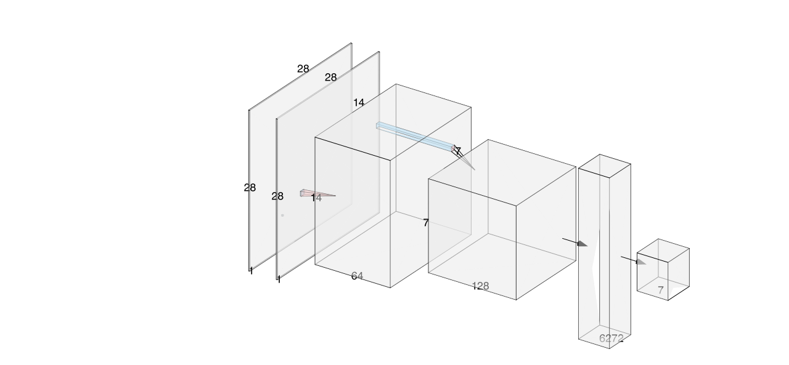

# DCGAN vs. Autoencoder: A Comparative Study on Generative Models

This project focuses on exploring and comparing two popular generative models:
**Deep Convolutional Generative Adversarial Networks** (DCGANs) and
**Autoencoders**. The goal is to evaluate the effectiveness of each model in
generating and reconstructing images and to provide insights into their
performance, architecture and applications.

## Contents

- [1. Introduction](#intro)
- [2. Overview](#ovv)
- [3. Requirements](#req)
- [4. Dataset](#dat)
- [5. Model Architectures](#modarch)
- [6. Training process](#trproc)
- [7. Evaluation](#eval)
- [8. Result](#rslt)
- [9. Conclusion](#cls)


<div id='intro'/>

## 1. Introduction

Generative models are powerful tools in **Deep Learning** that can generate
new data instances from a learned data distribution. This project compares two
generative approaches:

**DCGAN** - A direct extension of the GAN architecture that uses convolutional
and convolutional-transpose layers for the discriminator and generator,
respectively.

**Autoencoder** - A trained neural network to reconstruct its input, which can
also be used for generating new data by sampling from the latent space.

<div id='ovv'/>

## 2. Overview

The project consists of the following steps:
- Implement and train a DCGAN to generate realistic images.
- Implement and train an Autoencoder for image reconstruction.
- Evaluate the quality of images generated by both models.
- Compare the two models based on various metrics like image quality,
training time, and stability.

<div id='req'/>

## 3. Requirements

To run this project, you need the following libraries and tools:

- Python 3.7+
- PyTorch
- torchvision
- matplotlib
- numpy
- Jupyter Notebook (optional, for interactive exploration)

You can install the required dependencies using:
````
pip install torch torchvision matplotlib numpy
````

<div id='dat'/>

## 4. Dataset

For this project, we use the
[Celeb-A Faces dataset](https://mmlab.ie.cuhk.edu.hk/projects/CelebA.html),
a large-scale face dataset commonly used in generative model research.
You can download it from [Google Drive](https://drive.google.com/drive/folders/0B7EVK8r0v71pTUZsaXdaSnZBZzg). The dataset will download as a file named
img_align_celeba.zip. After downloading, make the celeba directory and
unzip the zip file into it. Next, use the celeba directory you just made
as the dataroot input for this notebook. The directory structure that
results should be:
```
/path/to/celeba
    -> img_align_celeba
        -> 188242.jpg
        -> 173822.jpg
        -> 284702.jpg
        -> 537394.jpg
           ...
```

<div id='modarch'/>

## 5. Model Architectures

### 5.1. DCGAN

A DCGAN consists of two networks: a Generator and a Discriminator.
These networks are trained adversarially—i.e., the Generator tries
to generate realistic images, while the Discriminator tries to
distinguish between real and generated images.

#### 5.1.1. Generator Architecture

The Generator Network consists of transposed convolutional layers,
batch normalization, and ReLU activations, culminating in a tanh activation
function to output realistic images. In detail, the Generator transforms a
latent vector z (usually sampled from a normal distribution) into a synthetic
image through a series of transposed convolutional layers. Each layer increases
the spatial dimensions of the input while reducing the depth, creating a
realistic image with the following structure:

- Input:
    - A latent vector of size nz (default 100), reshaped to (nz, 1, 1).
- First Transposed Convolution:
    - Input: (nz, 1, 1)
    - Output: (ngf * 8, 4, 4) (default ngf=64, so 512 channels)
    - Activation: ReLU
    - Batch Normalization: Yes
- Second Transposed Convolution:
    - Output: (ngf * 4, 8, 8) (default 256 channels)
    - Activation: ReLU
    - Batch Normalization: Yes
- Third Transposed Convolution:
    - Output: (ngf * 2, 16, 16) (default 128 channels)
    - Activation: ReLU
    - Batch Normalization: Yes
- Fourth Transposed Convolution:
    - Output: (ngf, 32, 32) (default 64 channels)
    - Activation: ReLU
    - Batch Normalization: Yes
- Final Output Layer:
    - Output: (nc, 64, 64) (where nc=3 for RGB images)
    - Activation: Tanh (to scale pixel values between -1 and 1).

#### Generator in AlexNet style


#### 5.1.2. Discriminator Architecture

The discriminator takes an image (real or fake) and classifies it as real
or fake using a series of convolutional layers:

- Input:
    - Image of size (nc, 64, 64).
- First Convolution:
    - Output: (ndf, 32, 32) (default 64 channels)
    - Activation: Leaky ReLU (α=0.2)
    - Batch Normalization: No
- Second Convolution:
    - Output: (ndf * 2, 16, 16) (default 128 channels)
    - Activation: Leaky ReLU
    - Batch Normalization: Yes
- Third Convolution:
    - Output: (ndf * 4, 8, 8) (default 256 channels)
    - Activation: Leaky ReLU
    - Batch Normalization: Yes
- Fourth Convolution:
    - Output: (ndf * 8, 4, 4) (default 512 channels)
    - Activation: Leaky ReLU
    - Batch Normalization: Yes
    - Final Fully Connected Layer:

- Output:
    - Single scalar representing the probability of the input being real or fake.
    - Activation: Sigmoid.

#### Discriminator in AlexNet style


### 5.2. Autoencoder

An Autoencoder consists of two main components: an Encoder and a Decoder.
The Encoder compresses an input image into a lower-dimensional latent
representation, and the Decoder reconstructs the original image from
this representation.


#### 5.2.1. Encoder Architecture

The Encoder gradually reduces the spatial dimensions of the input
image while increasing feature depth. This results in a compressed
latent representation. Layer-by-Layer Breakdown:

- Input Layer:
    - Input: (batch_size, 3, 64, 64) for RGB images.
- First Convolution Layer:
    - Kernel Size: 4x4, Stride: 2, Padding: 1
    - Output: (batch_size, 64, 32, 32)
    - Activation: Leaky ReLU
    - Batch Normalization: Yes
- Second Convolution Layer:
    - Kernel Size: 4x4, Stride: 2, Padding: 1
    - Output: (batch_size, 128, 16, 16)
    - Activation: Leaky ReLU
    - Batch Normalization: Yes
- Third Convolution Layer:
    - Kernel Size: 4x4, Stride: 2, Padding: 1
    - Output: (batch_size, 256, 8, 8)
    - Activation: Leaky ReLU
    - Batch Normalization: Yes
- Latent Representation:
    - Flatten the feature map into a latent vector.
    - Shape: (batch_size, latent_dim).

<<<<<<< HEAD
#### 5.2.1 Encoder ArchitectureDecoder Architecture
The Decoder takes the latent vector and progressively "upsamples" it back to the
original image dimensions using transposed convolutions. Layer-by-Layer Breakdown:
=======
#### Encoder in AlexNet style


#### 5.2.2. Decoder Architecture

The Encoder compresses an input image of size (batch_size, 1, 28, 28). Layer-by-Layer Breakdown:
>>>>>>> efe8a11 (readme: Add Alexnet figures)

- Input Layer:
    - Input: Latent vector (batch_size, latent_dim) reshaped to a small spatial feature map.
    - First Transposed Convolution Layer:
    - Kernel Size: 4x4, Stride: 2, Padding: 1
    - Output: (batch_size, 256, 8, 8)
    - Activation: ReLU
    - Batch Normalization: Yes
<<<<<<< HEAD
- Second Transposed Convolution Layer:
    - Kernel Size: 4x4, Stride: 2, Padding: 1
    - Output: (batch_size, 128, 16, 16)
    - Activation: ReLU
    - Batch Normalization: Yes
- Third Transposed Convolution Layer:
    - Kernel Size: 4x4, Stride: 2, Padding: 1
    - Output: (batch_size, 64, 32, 32)
    - Activation: ReLU
    - Batch Normalization: Yes
- Output Layer:
    - Transposed Convolution to match the original image dimensions (64, 64).
    - Activation: Sigmoid (to output pixel values between 0 and 1).
=======
- Second Transposed Convolutional Layer:
    - Input: (batch_size, 64, 14, 14)
    - Output: (batch_size, 1, 28, 28) (grayscale image reconstruction)
    - Kernel Size: 4
    - Stride: 2
    - Padding: 1
    - Activation: Tanh (to scale pixel values between -1 and 1)

#### Decoder in AlexNet style


This architecture captures the structure of the Autoencoder, where the Encoder compresses the input image into a latent vector, and the Decoder reconstructs the image from this representation.
>>>>>>> efe8a11 (readme: Add Alexnet figures)

<div id='trproc'/>

## 6. Training process

<div id='eval'/>

## 7. Evaluation

<div id='rslt'/>

## 8. Result

<div id='cls'/>

## 9. Conclusion